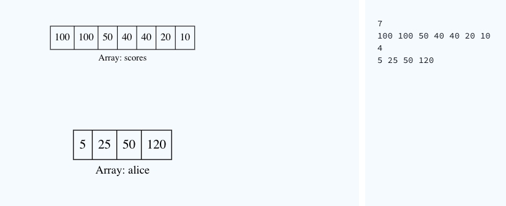
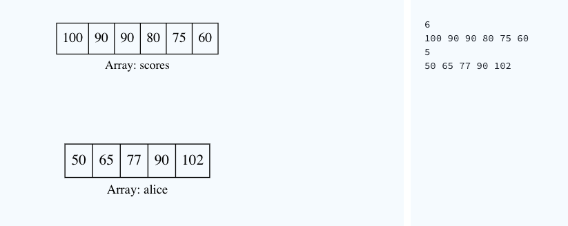

# Climbing the Leaderboard
  
Alice is playing an arcade game and wants to climb to the top of the leaderboard and wants to track her ranking. The game uses Dense Ranking, so its leaderboard works like this:

- The player with the highest score is ranked number  on the leaderboard.

- Players who have equal scores receive the same ranking number, and the next player(s) receive the immediately following ranking number.

For example, the four players on the leaderboard have high scores of **100**, **90**, **90**, and **80**. Those players will have ranks **1**, **2**, **2**, and **3**, respectively. If Alice's scores are **70**, **80** and **105**, her rankings after each game are  and .

<br/>

## Function Description

Complete the climbingLeaderboard function in the editor below. It should return an integer array where each element **res[j]** represents Alice's rank after the  game.

climbingLeaderboard has the following parameter(s):

- scores: an array of integers that represent leaderboard scores
- alice: an array of integers that represent Alice's scores

<br/>

## Input Format

The first line contains an integer **n**, the number of players on the leaderboard.  
The next line contains **n** space-separated integers **scores[i]**, the leaderboard scores in decreasing order.  
The next line contains an integer, , denoting the number games Alice plays.  
The last line contains **m** space-separated integers **alice[j]**, the game scores. 

<br/>

## Constraints

- 
- 
- 
- 
- The existing leaderboard, **scores**, is in descending order.
- Alice's scores, **alice**, are in ascending order.

<br/>

## Subtask

For `60%` of the maximum score:

- 
- 

<br/>

## Output Format

Print **m** integers. The  integer should indicate Alice's rank after playing the  game.

<br/>

## Sample Input 1


<br/>

## Sample Output 1
```
6
4
2
1
``` 

<br/>

## Explanation 1

Alice starts playing with **7** players already on the leaderboard, which looks like this:


After Alice finishes game **0**, her score is **5** and her ranking is **6**:


After Alice finishes game **1**, her score is **25** and her ranking is **4**:


After Alice finishes game **2**, her score is **50** and her ranking is tied with Caroline at **2**:


After Alice finishes game **3**, her score is **120** and her ranking is **1**:


<br/>

## Sample Input 2


<br/> 

## Sample Output 2
```
6
5
4
2
1
```

<br/>

---

### `Solution (Accepted)`

```javascript
function climbingLeaderboard(scores, alice) {
  let values = [...new Set(scores)];
  let ranking = values.length - 1;

  return alice.reduce((target, score) => {
    while (ranking > 0 && score > values[ranking]) --ranking;
    target.push((values[ranking] > score) ? ranking + 2 : ranking + 1);

    return target;
  }, []);
}
```
<br/>

### Solution (Terminated due to timeout)

```javascript
function climbingLeaderboard(scores, alice) {
  const scoreSet = new Set(scores);
  let iter = scoreSet[Symbol.iterator]();
  let result = scoreSet.size + 1;

  return alice.reduce((target, a, index) => {
    let count = 1;
    for (const score of scoreSet.values()) {
      if (score > a) {
        iter.next()
      } else {
        result = count;
        break;
      }
      count++;
    }

    target.push(result);
    return target;
  }, []);
}
```
<br/>

### Solution (Terminated due to timeout)

```javascript
function climbingLeaderboard(scores, alice) {
    const scoreSet = [...(new Set(scores))];
    let isAssign = false;
    let result = -1;

    return alice.reduce((target, score) => {
        let currentIndex = scoreSet.findIndex(v => v === score);
        currentIndex >= 0
            ? (result = currentIndex)
            : (isAssign = true);

        isAssign && (
            scoreSet.push(score),
            result = scoreSet.sort((a, b) => b - a).findIndex(v => v === score),
            scoreSet.splice(result, 1),
            isAssign = false
        );
        
        target.push(result + 1);

        return target;
    }, []);
}
```
<br/>

### Solution (Terminated due to timeout)

```javascript
function climbingLeaderboard(scores, alice) {
    const scoreSet = [...(new Set(scores))];
    let isAssign = false;
    let result = -1;

    return alice.reduce((target, score) => {
        const scoreSet = new Set(scores);
        scoreSet.add(score);
        target.push([...scoreSet].sort((a, b) => b - a).findIndex(v => v === score) + 1);

        return target;
    }, []);
}
```